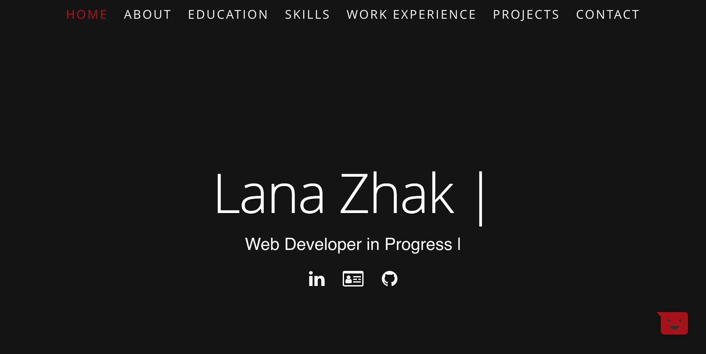

# Lana Zhak's Portfolio

Portfolio website created with React.js and Material-UI, hosted on Heroku http://lana-zhak.herokuapp.com/. Hotjar is used to collect information about visitors.

## Development

`npm i`
`npm run-script start`

## Deployment

Pushing to github triggers Heroku autodeploy.

`git push`
